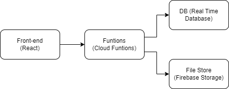

# Employee Management App

## Description

The Employee Management App is a sophisticated and user-friendly software application designed to streamline the employee onboarding process. This system allows to easily submit new employees personal data and required documents for employment contracts. The application is tailored to meet the needs of HR departments, ensuring efficient data handling and document management.

### Features

- **User-Friendly Interface**: The application boasts a responsive and intuitive UI, making it easy for new employees to navigate and submit their information.

- **Employee Registration**: A dedicated section to enter new employees personal details, including Name, Date of Birth, CPF, Email, Cellphone Number, and Address. The system also allows for the upload of essential documents such as Employment Contracts, CPF/RG, Proof of Address, and School Curriculum in PDF format.

- **Search and Display Functionality**: HR staff can search for employees using metadata fields and document types. The system displays a comprehensive list of all registered employees, with the ability to view detailed information and documents.

- **Deletion and Editing of Employees**: The system supports the deletion and editing of employee records. HR administrators can easily remove outdated or redundant entries, as well as update information for existing employees as needed. This feature enhances the overall flexibility and maintenance of employee data.

# [production] Getting Started

### Backend
To access the production backend of the app, go to:
https://console.firebase.google.com/u/0/project/employeemanagementapp-767af/overview

If any account needed, please request the developers.

### Frontend
To access the production frontend of the app, go to:
https://employeemanagementapp-767af.web.app/

Be aware that all data are being storaged in public production environment.

# [local] Getting Started

## Dependencies

This project requires Firebase. To install it, run the following command:

```bash
npm install -g firebase-tools
```

## Project Setup

### Backend

To set up and run the backend of the app, follow these steps:

1. Navigate to the backend folder:
   ```bash
   cd .\backend\functions
   ```
2. Install the required dependencies:
   ```bash
   npm install
   ```
3. Start the Firebase emulator:
   ```bash
   firebase emulators:start
   ```

### Frontend

To set up and run the frontend of the app, follow these steps:

1. Navigate to the frontend folder:
   ```bash
   cd .\frontend\employee-management-app
   ```
2. Install the required dependencies:
   ```bash
   npm install
   ```
3. Start the application:
   ```bash
   npm start
   ```

# System Architecture

This project follows a microservices-based architecture, utilizing modern technologies to provide an efficient and scalable system. Below, we detail the key components of the architecture.

## Frontend

- **Technology:** React
- **Hosting:** Firebase Hosting
- **Characteristics:** 
  - The frontend is developed using React, a JavaScript library for building user interfaces.
  - Hosted on Firebase Hosting, the frontend is completely serverless, offering high availability and scalability.
  - Communication with backend services is performed through calls to Cloud Functions.

## Backend

### Cloud Functions

- **Function:** 
  - Firebase Cloud Functions are used for server-side operations such as data processing and integration with other services.
  - They act as an intermediary layer between the frontend and the database, managing requests and responses.

### Realtime Database

- **Function:** 
  - The Firebase Realtime Database is used for storing and synchronizing data in real-time.
  - This NoSQL database allows for efficient and real-time communication with the frontend.

### Firebase Storage

- **Function:** 
  - Firebase Storage used for storing files.
  - Provides a robust and secure solution for file storage and retrieval.

## Diagram


## Integration and Data Flow

- The frontend, developed in React, makes requests to Cloud Functions.
- Cloud Functions process these requests, interacting with the Realtime Database to retrieve or store data.
- Firebase Storage is used to manage files related to employees.

---

This architecture is designed for easy maintenance, the choice of technologies and the serverless approach enable rapid development and deployment, significantly reducing the time-to-market for new features and updates.

## Frontend Structure and Libraries

### Folder Structure

Given the small size of the project, the components were not subdivided into smaller sections. However, for larger or potentially expanding projects, the Atomic Design structure could be employed. The current project's folder structure is organized as follows:

/src
| /assets
| /components
| /pages


- **/assets:** Contains project-related assets such as images, icons, or other media.

- **/components:** Houses reusable React components used throughout the application.

- **/pages:** Includes individual page components representing different views of the application.

### Material-UI Library

The Material-UI (MUI) library was utilized to assist in the creation of the user interface components. MUI provides a set of pre-designed React components that follow the Material Design guidelines. This library enhances the development process by offering a consistent and visually appealing design, reducing the need for extensive custom styling. Its modular nature also promotes code reusability and maintains a cohesive look and feel across the application.


## Decision-Making Process
Key decisions made during the solo development of the project, covering crucial aspects from technology choices to system architecture. Given the one-week timeframe for a solo project, decisions were focused on efficiency and rapid development.

### System Architecture
**Decision:** It was choosen a microservices-based architecture for easy maintenance and efficiency.

**Justification:** This choice allows for easier maintenance and agile development of new features within the limited time frame.

### Technology Stack
**Decision:** The project utilized React for the frontend and Firebase for the backend, leveraging seamless integration.

**Justification:** Choosing these technologies provides a dynamic and efficient user experience while simplifying backend operations, crucial for rapid development.

### User Interface Design
**Decision:** The approach prioritized a simple and intuitive interface, where the design could connect somehow with the Company style.

**Justification:** 


## Design
In the design phase, careful consideration was given to several key elements, ensuring a visually appealing and user-friendly interface.

### Iron Mountain Website Style

The design palette drew inspiration from the Iron Mountain website, incorporating a harmonious blend of colors to evoke a professional and modern aesthetic.

#### Color Palette:

- **Blue:**
  - Main: `#00b7cb`
  - Light: `#b1e9ee`
  - Dark: `#005b5d`
  - Contrast Text: `white`

- **Orange:**
  - Main: `#fa9f55`
  - Light: `#ffe1c0`
  - Dark: `#e3794a`
  - Contrast Text: `white`

These carefully selected colors contribute to a cohesive and visually pleasing design that aligns with the branding style of Iron Mountain.

### Similar HR Systems

Taking inspiration from other successful HR systems, the design incorporates elements that have proven effective in similar applications. This ensures a familiar and intuitive experience for users already accustomed to industry-standard interfaces.

### UI/UX

The User Interface (UI) and User Experience (UX) were paramount considerations in the design process. The goal was to create an interface that not only looks visually appealing but also provides a seamless and efficient experience for users interacting with the application.

### Material UI Library

The Material UI library was leveraged to enhance the design consistency and streamline the development process. Material UI provides a set of pre-designed components and styling guidelines, ensuring a modern and responsive design while maintaining a cohesive look and feel throughout the application.

By combining the design principles inspired by Iron Mountain, insights from successful HR systems, and the versatility of the Material UI library, the design aims to deliver a polished, user-centric experience that meets both aesthetic and functional requirements.


## Technical Debt

The project was developed in one week as part of a job interview process. Due to this time constraint, some essential practices and functionalities were omitted or simplified.

### Authentication and Authorization:

**Current Problem:** Currently, all functions and file storage are public, posing a significant security risk.

**Solution:** Implement a robust authentication and authorization system. This may include integrating Firebase authentication features.

### Access Control and Data Security:

**Current Problem:** The absence of proper access controls can lead to unauthorized access to sensitive employee information.

**Solution:** Establish role-based access control policies, ensuring that users only access the data necessary for their roles and responsibilities. A proposed solution for that would be having a Employee role and a HR role.

### Pagination

**Current Scenario:** The application currently displays a fixed number of employees per page, potentially leading to a suboptimal user experience when dealing with a large number of records.

**Solution:** Implement pagination to divide the employee list into manageable pages, improving load times and navigation for users. This ensures a smoother experience, especially when dealing with extensive datasets.

### Filter by Document Types

**Current Scenario:** There is no specific mechanism to filter or categorize employees based on document types, making it challenging to organize and retrieve relevant information.

**Solution:** Introduce a filter option allowing users to categorize and view employees based on document types such as Employment Contracts, CPF/RG, Proof of Address, etc. This enhances data organization and facilitates efficient retrieval.

### Mobile-Friendly

**Current Scenario:** The current application design may not be optimized for mobile devices, potentially impacting the user experience for those accessing the system on smaller screens.

**Solution:** Implement a mobile-friendly design, ensuring responsive layouts and an intuitive interface for users accessing the application on various devices. This enhancement promotes accessibility and usability across different platforms.


## Proposed Enhancements

In an effort to enhance the functionality and user experience of the Employee Management App, the following proposed enhancements aim to address current limitations and streamline key processes.

### Select Multiple and Group Actions

**Current Scenario:** If more than one employee needs to be updated, deleted, or any new action, this needs to be done one by one.

**Solution:** Introduce a multiple selection feature on the /employees page, enabling users to perform actions on a group of selected employees. This includes options for bulk updates, deletions, or other relevant actions.

### Contact Employee(s)

**Current Scenario:** If HR needs to contact employees, they would need to retrieve individual contacts, copy the information, and use it in other platforms.

**Solution:** Implement a streamlined contact feature, allowing HR to easily communicate with one or more employees directly within the application. This feature could include messaging templates, email integration, or other communication tools.

### Import/Export Employees

**Current Scenario:** If HR needs to obtain a list of employees and their information or upload multiple employees, they would need to go through the process one by one.

**Solution:** Introduce robust import/export functionality that enables HR to efficiently manage employee data. This includes the ability to export a comprehensive list of employees, make bulk updates via import, and ensure seamless data integration with external systems.

### Drag and Drop or Multi-Select File Section

**Current Scenario:** If HR needs to contact employees, they would need to get the contacts one by one, copy the information, and use it in other platforms.

**Solution:** Enhance the file management section by introducing drag-and-drop functionality or multi-select capabilities. This improvement simplifies the process of managing files, allowing HR to efficiently organize and utilize employee-related documents.

These proposed enhancements aim to optimize HR workflows, reduce manual tasks, and improve overall efficiency in managing employee data and communications within the application.
